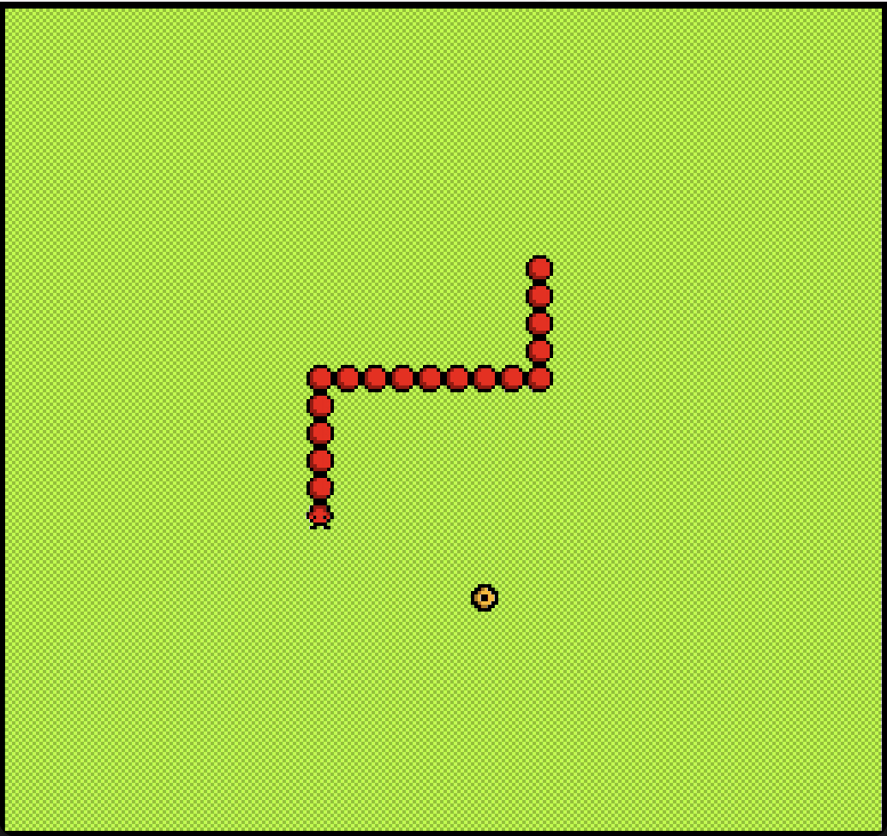

# The Hungry Caterpillar

Author: Kavya Tummalapalli

Design: What is new and interesting about my game is instead of the basic snake game concept of not colliding with the walls or itself, my game allows for the satisfying endless board with a focus on how satiated you can keep your caterpillar. If the caterpillar eats the flowers too slowly, it will start to lose its length and longevity and disappear!

Screen Shot:

How My Asset Pipeline Works:

My [asset pipeline](LoadedData.cpp) begins with my [source files](assets/), which are all 8x8 pixel PNGs with a maximum of four colors. I use the load_png function to extract the size and color data from the image and then go through this data pixel by pixel, storing the tile and palette information in a struct I created. In the PlayMode file, I then Load this pipeline function as many times as I need, providing different input images to create tiles for all my drawings. This data is now all in the form of tiles and palettes which can easily be used throughout the rest of my code.

How To Play:

Press the left, right, up, and down arrow keys to change the caterpillar's direction. Eat as many flowers as quickly as you can so your caterpillar can stay healthy and happy and become a beautiful butterfly :)

This game was built with [NEST](NEST.md).

